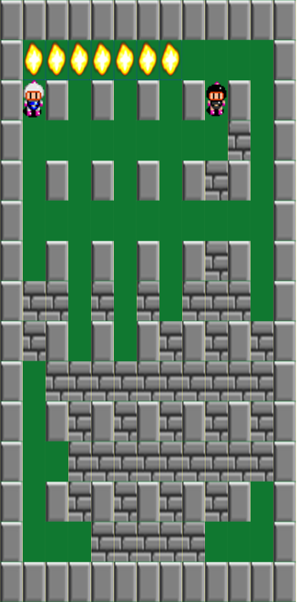

# Boom Boy #

[Live](http://danielrothblatt.me/boom-boy)



## Instructions ##

### One Player ###

Move with <kbd>←</kbd><kbd>↑</kbd><kbd>→</kbd><kbd>↓</kbd>. Drop bombs with <kbd>space</kbd>.

### Two Players ###

Player 1 (white): Move with <kbd>w</kbd><kbd>a</kbd><kbd>s</kbd><kbd>d</kbd>, drop bombs with <kbd>f</kbd>.
Player 2 (black): Move with <kbd>i</kbd><kbd>j</kbd><kbd>k</kbd><kbd>l</kbd>, drop bombs with <kbd>h</kbd>.

### The Goal ###

The goal is to be the last boom boy standing. You work towards this
goal by blowing up your enemies with your bombs. Bombs will explode on
their own shortly after you plant them. Be sure you don't blow
yourself up!

If a bomb is in your way, you can't walk through it or move it--so be
careful! Don't let anybody trap you.

Stages have two kinds of obstacles, bricks and pillars. Explosions
can destroy bricks, but not pillars.

## Features ##

### 2D Rendering ###

Boom Boy uses Easel.js for 2D rendering because it provides a simple
interface to the HTML5 canvas element.

Rendering is done by the Board class (`board.js`). The Board has a
property `grid`, a 2D array storing references to every other game
object, and its `draw` method picks the appropriate image to render at
every position in the grid.

``` javascript
draw() {
    const floorTile = new createjs.Bitmap('./assets/floor.png');
     for (let i = 0; i < this.numCols; i++) {
        for (let j = 0; j < this.numRows; j++) {
            const xPos = i * this.boxLength;
            const yPos = j * this.boxHeight;
             floorTile.x = xPos;
            floorTile.y = yPos;
            this.stage.addChild(floorTile);
             let tileType = this.grid[i][j] || "floor";
            if (tileType instanceof Movable) { tileType = "floor"; }
             const tile = new createjs.Bitmap(`./assets/${tileType}.png`);
            tile.x = xPos;
            tile.y = yPos;
            this.stage.addChild(tile);
        }
    }
    const players = this.humanPlayers.concat(this.aiPlayers);
    players.forEach(player => player.draw(this.boxLength, this.boxHeight));
}
```

### Movement ###

### Bombs ###
